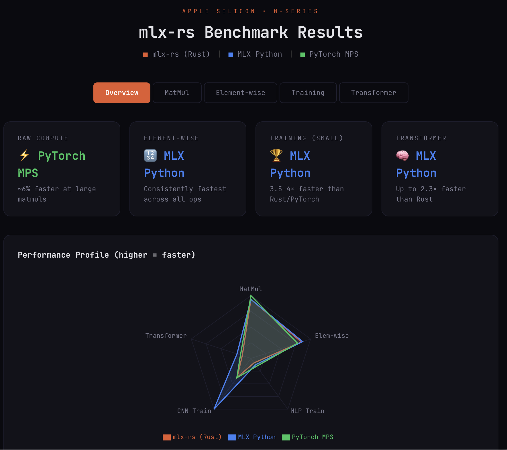

# mlx-rs

Rust bindings for [MLX](https://github.com/ml-explore/mlx), Apple's array framework for machine learning on Apple silicon.

## Overview

MLX is an array framework for machine learning research on Apple silicon. `mlx-rs` provides safe, idiomatic Rust bindings to MLX via the [mlx-c](https://github.com/ml-explore/mlx-c) C API.

### Features

- **Safe Rust API**: High-level, ergonomic interface with automatic memory management
- **Zero-cost abstractions**: Thin wrapper over mlx-c with minimal overhead
- **Type safety**: Strongly-typed arrays and operations
- **Lazy evaluation**: Leverage MLX's lazy computation model
- **Unified memory**: Arrays accessible from both CPU and GPU without copies

## Project Structure

This repository contains two crates:

- **`mlx-sys`**: Low-level FFI bindings to mlx-c (unsafe)
- **`mlx`**: High-level safe Rust API (recommended for users)

## 🧪 Installation & Setup

**Note:** These instructions are for the `release` branch, which uses dynamic binding generation.

### Prerequisites

1. **macOS with Apple Silicon** (M1, M2, M3, or later)
2. **Xcode Command Line Tools**: `xcode-select --install`
3. **CMake**: `brew install cmake`

### Step 1: Build the MLX-C Engine

`mlx-rs` relies on the C-wrapper to interface with the C++ core. 

**Why a fork?** The official `mlx-c` passes `mlx_optional_int` structs by value, 
which causes an [ABI mismatch](docs/Rust_C_ABI_Mismatch_Quantization.md) when called 
from Rust on ARM64. Our fork adds thin C wrapper functions that accept plain `int` parameters. 

You must build this locally first:

```bash
# Clone the patched mlx-c (includes quantize wrapper functions)
git clone https://github.com/MisterEkole/mlx-c.git
cd mlx-c


# Build with CMake
mkdir build && cd build
cmake .. -DCMAKE_BUILD_TYPE=Release
make -j
```

### Step 2: Setup mlx-rs

```bash
# Clone the repository and switch to the release branch
git clone -b release https://github.com/MisterEkole/mlx-rs.git
cd mlx-rs

# Set the critical environment variable (Replace with your actual path from Step 1)
export MLX_C_PATH=/path/to/your/mlx-c

# Run the pre-flight check script to verify libraries are found
chmod +x check_env.sh
./check_env.sh
```

**CRITICAL:** You must build the mlx-sys crate first. This triggers the build script to generate a fresh `bindings.rs` file tailored to your local machine.

```bash
# Build the sys crate to generate bindings.rs
cargo build -p mlx-sys
```

### Step 3: Run Examples

Once the environment is validated and bindings are generated, you can run the provided test cases:

```bash
# Test basic array operations
cargo run --example basic_ops

# Test a Convolutional Neural Network training loop
cargo run --example cnn
```

### Step 4: Run Mistral-7B Inference

Run a full Mistral-7B large language model locally on Apple Silicon:
```bash
# Install HuggingFace CLI (if not already)
pip install huggingface-hub

# Login to HuggingFace
huggingface-cli login

# Download Mistral-7B-v0.1 (~14GB)
huggingface-cli download mistralai/Mistral-7B-v0.1 \
    "model-00001-of-00003.safetensors" \
    "model-00002-of-00003.safetensors" \
    "model-00003-of-00003.safetensors" \
    "tokenizer.json" \
    "config.json" \
    --local-dir ./mistral-7b

# Generate text
cargo run --example mistral -- ./mistral-7b "What is Rust?"
```


## 📊 Benchmarks

We compared the performance of **mlx-rs**, **MLX Python**, and **PyTorch MPS** across various machine learning workloads. Because all three frameworks dispatch to the same underlying Apple Metal kernels, the primary performance differences come from the execution model and framework overhead.

[](https://claude.site/public/artifacts/8f2a2466-0c6c-4edd-a44a-8c12a2c935a0)


### Key Findings

* **MLX Python is the overall winner:** It is particularly dominant on training and inference—up to **4× faster** than mlx-rs on small MLP training and **2.6× faster** on CNN training. While Rust inherently has less overhead, MLX Python's `value_and_grad` and optimizer are likely batching operations much more efficiently into the compute graph before dispatching to Metal.
* **mlx-rs suffers from FFI overhead in training loops:** The Rust→C FFI boundary adds per-operation latency that becomes highly visible on smaller models. However, on pure compute workloads (like large matrix multiplications and element-wise operations), all three frameworks are within **~5%** of each other since the heavy lifting is done by the exact same Metal kernels.
* **PyTorch MPS has the best large matmul kernels:** PyTorch scales slightly better on massive matrices (roughly **6% faster** at 4096²). However, it falls behind on small-batch training, where its eager execution model adds significant overhead compared to MLX's lazy evaluation.

### Future Optimizations

The primary optimization opportunity for `mlx-rs` is reducing the number of FFI calls per training step. We are actively exploring exposing a fused `value_and_grad` + optimizer step directly at the C level to eliminate the Rust→C roundtrips during tight training loops.

## ANE Offload — `--features ane_offload`

mlx-rs includes an optional feature that routes `Linear::forward` through Apple's Neural Engine (ANE) via private APIs, bypassing Core ML's scheduler. Everything else — autograd, optimizer, loss — stays on MLX. The ANE path falls back silently to MLX GPU on any failure.

```rust
// No API changes. The feature flag does the routing.
let linear = Linear::new(512, 1024, true, &key)?;
let out = linear.forward(&x)?;  // → ANE if available, MLX GPU otherwise
```

**GPT-2 inference benchmark** (4-layer transformer, 384 dims, batch×seq=32 tokens):

```
Warmup (25 ANE compiles):   1002 ms   ← one-time cost
Cached forward (50 runs):     14.9 ms mean,  13.2 ms min

Layer-level ANE vs GPU:
  q_proj  [384→ 384]   ANE: 187 µs   GPU: 282 µs   1.51× faster
  fc1     [384→1536]   ANE: 446 µs   GPU: 372 µs   1.20× slower  ← CPU round-trip overhead
  fc2     [1536→ 384]  ANE: 450 µs   GPU: 370 µs   1.22× slower
  lm_head [384→1000]   ANE: 402 µs   GPU: 315 µs   CoreML fallback (slot 25/24 cap)

Throughput:
  batch=1   14.4 ms   2,220 tok/s
  batch=2   18.6 ms   3,449 tok/s
  batch=4   21.7 ms   5,911 tok/s
```

The attention projection is faster on ANE. The FFN layers are currently slower due to a CPU round-trip between the MLX Metal buffer and the ANE IOSurface — a known gap documented in [WHATSNEW.md](WHATSNEW.md). Eliminating it requires one Metal shader that has not been implemented yet.

```bash
# Run the GPT-2 inference benchmark
cargo run --example gpt2_ane_bench --features ane_offload --release

# Run the per-layer ANE vs GPU benchmark
cargo run --example ane_bench --features ane_offload --release

# See per-call ANE dispatch logs
RUST_LOG=debug cargo run --example gpt2_ane_bench --features ane_offload --release
```

> Uses Apple's private `AppleNeuralEngine.framework`, reverse-engineered by [maderix](https://github.com/maderix/ANE). Subject to breakage on macOS updates. Fallback to MLX GPU is always active.

Full details — cache design, compile budget, daemon slot limit, what's next — in [WHATSNEW.md](WHATSNEW.md).

## Development Status

**⚠️ Early Development**: This project is in early development. APIs may change. Advanced features are being added regularly.

**📊 For detailed project development and API coverage status, see [API_COVERAGE.md](API_COVERAGE.md)**

## Contributing

Contributions are welcome! This project follows the same spirit as MLX - designed by ML researchers for ML researchers.

## Architecture

```
┌─────────────────────────────────────┐
│  Your Rust Application              │
└──────────────┬──────────────────────┘
               │
               ▼
┌─────────────────────────────────────┐
│  mlx crate (Safe Rust API)          │
│  - Array, Dtype types                │
│  - Memory management via Drop        │
│  - Error handling                    │
└──────────────┬──────────────────────┘
               │
               ▼
┌─────────────────────────────────────┐
│  mlx-sys (Raw FFI Bindings)         │
│  - Generated via bindgen             │
│  - Unsafe C function declarations    │
└──────────────┬──────────────────────┘
               │
               ▼
┌─────────────────────────────────────┐
│  mlx-c (C API)                       │
│  - C wrapper around MLX C++          │
└──────────────┬──────────────────────┘
               │
               ▼
┌─────────────────────────────────────┐
│  MLX (C++ Core)                      │
│  - Metal shaders                     │
│  - Array operations                  │
│  - Neural network primitives         │
└─────────────────────────────────────┘
```

## Why Rust + MLX?

- **Safety**: Rust's ownership system prevents common bugs
- **Performance**: Zero-cost abstractions compile to efficient code
- **Ecosystem**: Integrate with Rust's rich crate ecosystem
- **Ergonomics**: Idiomatic Rust API following language conventions
- **Apple Silicon**: Native performance on M-series chips

## License

MIT License - see LICENSE file for details.

This project is not officially affiliated with Apple. MLX is created by Apple's machine learning research team.

## Resources

- [MLX Documentation](https://ml-explore.github.io/mlx/)
- [MLX GitHub](https://github.com/ml-explore/mlx)
- [MLX C GitHub](https://github.com/ml-explore/mlx-c)
- [MLX Swift](https://github.com/ml-explore/mlx-swift) (similar approach for Swift)

## Acknowledgments

- Apple ML Research team for creating MLX
- The mlx-c contributors for providing the C API bridge
- The Rust community for excellent FFI tooling
